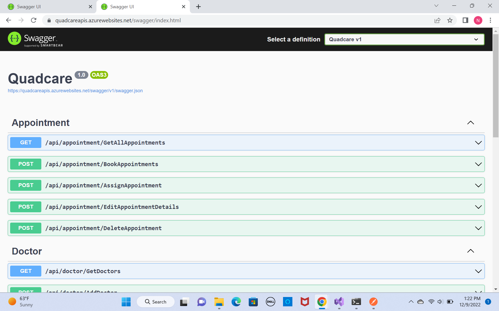
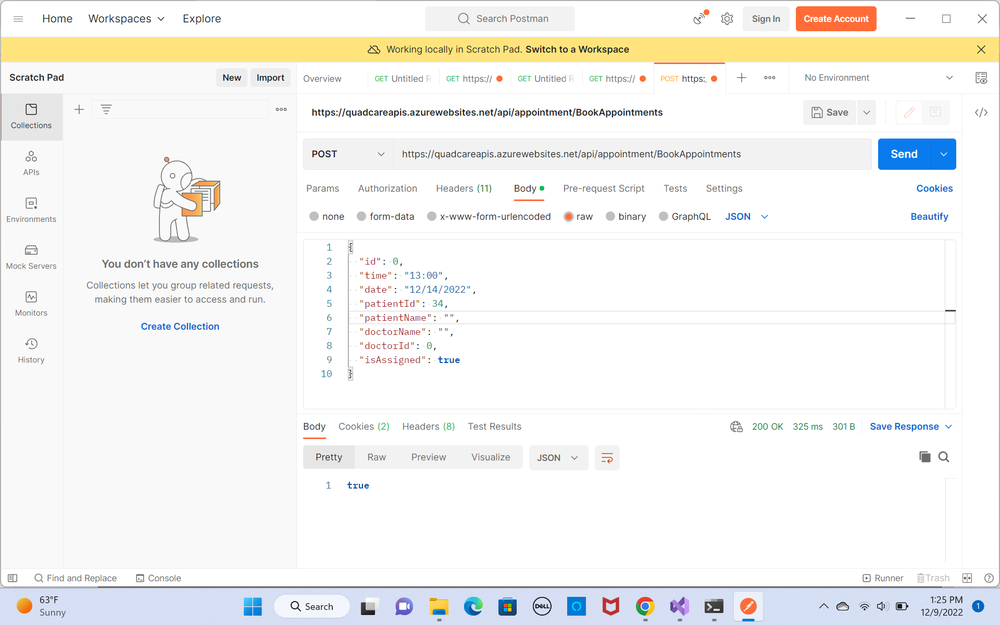
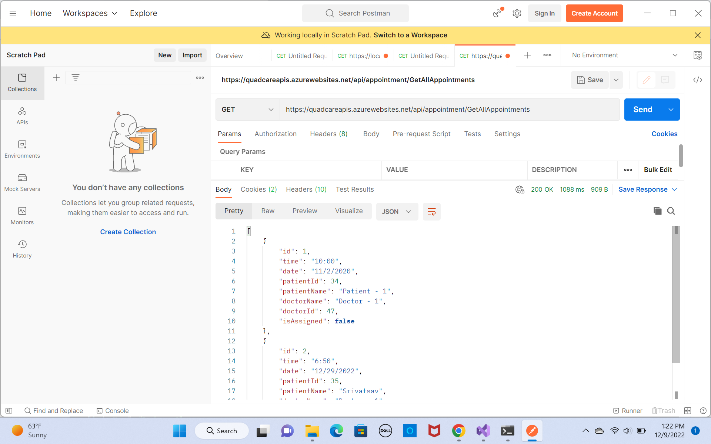

# ASP.NET Core WebApi for Quadcare application a hospital management application.

See the examples here: 

## Versions

``` https://quadcareapis.azurewebsites.net/swagger ```



## GET All Appointments

``` https://quadcareapis.azurewebsites.net/api/appointment/GetAllAppointments ```



## POST - Book an Appointment

``` https://quadcareapis.azurewebsites.net/api/appointment/BookAppointments ```



```javascript
  {
       "id": 0,
      "time": "13:00",
      "date": "12/14/2022",
      "patientId": 34,
      "patientName": "",
      "doctorName": "",
      "doctorId": 0,
      "isAssigned": true
  }
```
